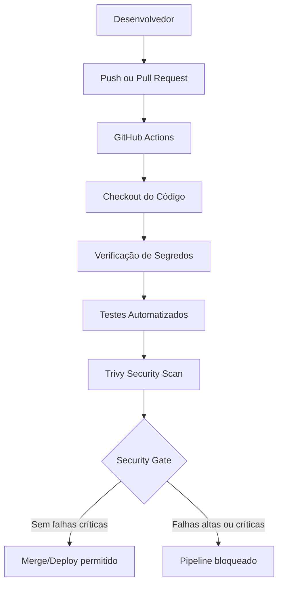

# Diagrama do Pipeline DevSecOps

```mermaid
flowchart TD
    A[Desenvolvedor] --> B[Push ou Pull Request]
    B --> C[GitHub Actions]
    C --> D[Checkout do Código]
    D --> E[Verificação de Segredos]
    E --> F[Testes Automatizados]
    F --> G[Trivy Security Scan]
    G --> H{Security Gate}
    H -->|Sem falhas críticas| I[Merge/Deploy permitido]
    H -->|Falhas altas ou críticas| J[Pipeline bloqueado]
```
